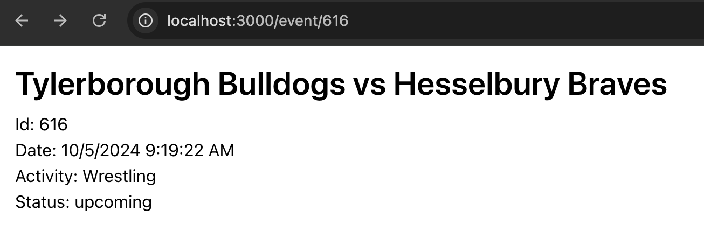

# NFHS Network Interview Prep

This project is set up with React as the frontend and Rails as the backend in API mode.

The goal of this assignment is to complete the requirements listed below and provide your submission prior to your technical interview so we can review it together.

## Local development

To get started with local development, first:

```bash
# use project node / ruby versions
nvm use
rvm use

# install the frontend dependencies
yarn install

# install the ruby gems
yarn bundle
```

Then, start the development servers:

```bash
# concurrently serve resources
yarn dev
# Nuxt: http://localhost:3000
# Rails API: http://localhost:3001

# alternatively, open separate terminals
yarn start
cd api && rails server

# run tests
yarn test
cd api && rails test
```

# Assignment

For your submission, please create a separate branch based on `main` and follow the naming pattern below.

`task/interview-prep-[f-initial][last-name]`

- Implement pagination on the `events#index` controller definition. It should accept a page or starting value and a size.

- Apply the pagination on the frontend by adding a button that fetches the next page and appends it to state.

  

- Implement a route and action for `events/[event_id]` that returns a single record if found.

- Add a page to the frontend `/events/:id` that simply displays the data for that event if found.

- Add an `onClick` handler to the `EventCard` that navigates to that events page.

  

- Implement a `Tournament` model and basic CRUD (Create, Read, Update, Delete) operations. It should have a title, slug, and a reference to games. It should have validations that require all fields. The slug should be generated from a callback on the tournament's title before saving.
